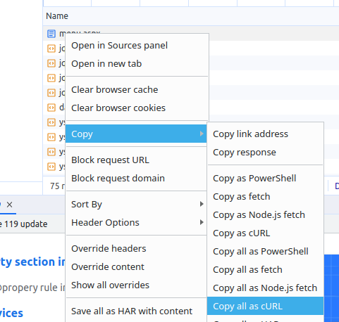

# Yardi Tools

This project provides some tools to extract data from yardi voyager using Ruby and Thor.

```bash

thor yardi_tools:extract_all_tenants URL       # extracts all tenants to a CSV out.csv
  #example usage:
  #thor yardi_tools:extract_all_tenants "https://www.yardiasp14.com/PROPERTY_ID/pages/ResResident.aspx?ResidentId=TENANT_ID&sMessage="

thor yardi_tools:extract_tenant URL TENANT_ID  # extracts a tenant information from a url using tenant ids stored in a file called "tenant_ids.txt" and writes it to standard output
  #example usage:
  #thor yardi_tools:extract_tenant "https://www.yardiasp14.com/PROPERTY_ID/pages/ResResident.aspx?ResidentId=TENANT_ID&sMessage=" 1234

```

## Cookies

The code gains access to your Yardi instance using cookies from your browser.  To get cookies to provide to this tool, log into Voyager, find a network request for the page loaded and extract the cookies for that page by right clicking on the request and copying the request as a CURL command:



Find the cookies header and save its value to a file called cookies.txt.

## Code to extract tenant IDs from Voyager

Run a "Find Resident" search.  On the right, a box should pop up with all the tenants for the property.  List as many tenants as you can in the box (e.g. select 100 per page).
For each page you page through, run the following code in the browser's console:

```js
// LOAD JQUERY
var jq = document.createElement('script');
jq.src = "https://ajax.googleapis.com/ajax/libs/jquery/3.5.1/jquery.min.js";
document.getElementsByTagName('head')[0].appendChild(jq);
jQuery.noConflict();

//EXTRACT TENANT IDS FROM THE PAGE
function gethref(a){ return a.href}
hrefs = $('#dataTable1').find('a').toArray().map(gethref)
hrefs.map(function asdf(item){ return (new URLSearchParams(item)).get('TenantId') })
```

Save those returned tenant IDs in a `tenant_ids.txt` file with one tenant id per line.